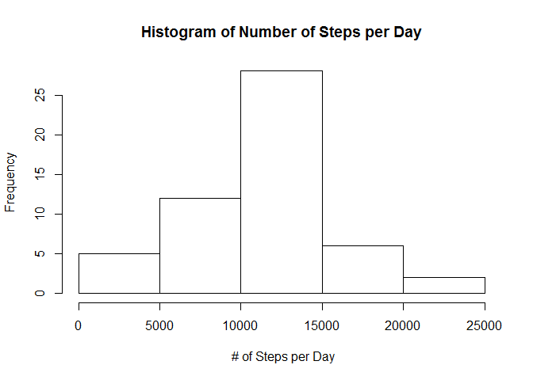
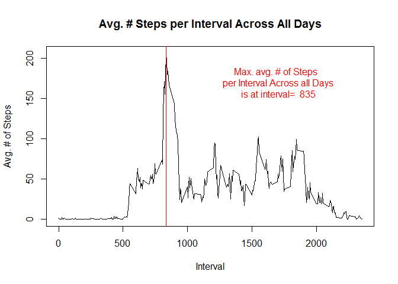
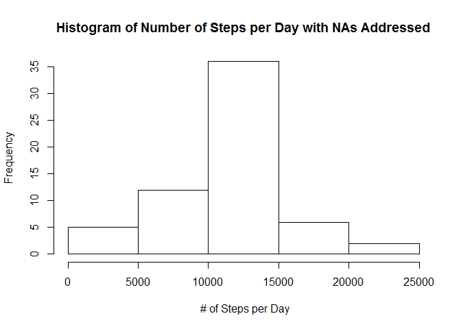
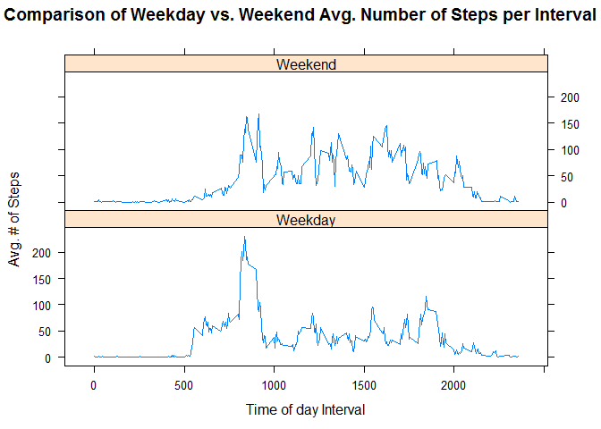

# Reproducible Research: Peer Assessment 1
Author: Anthony Trivelli

## Background

It is now possible to collect a large amount of data about personal movement using activity monitoring devices such as a Fitbit, Nike Fuelband, or Jawbone Up. These type of devices are part of the "quantified self" movement - a group of enthusiasts who take measurements about themselves regularly to improve their health, to find patterns in their behavior, or because they are tech geeks. But these data remain under-utilized both because the raw data are hard to obtain and there is a lack of statistical methods and software for processing and interpreting the data.

## Input file details:
#### The underlying file is an activities file hat was provided by the course

#### The variables included in this dataset are:

      - steps: Number of steps taking in a 5-minute interval (missing values are coded as NA)
      - date: The date on which the measurement was taken in YYYY-MM-DD format
      - interval: Identifier for the 5-minute interval in which measurement was taken
      - * The dataset is stored in a comma-separated-value (CSV) file and there are a total
        of 17,568 observations in this dataset.

## Loading and preprocessing the data

```r
## Read in Raw file
act <- read.csv("activity.csv", header= TRUE)
```


```r
## show Structure of file
str(act)

head(act, 100)

## Lets look at the data to understand it
nas <- act[is.na(act)]
unique(act$interval)
summary(act)
```


```r
# format for use
act2 <- mutate(act, ddate= as.Date(act$date))
```


## What is mean total number of steps taken per day?


```r
## Calculate the total number of steps per day
stepsperday <- ddply( act2, .(ddate), summarize, sum= sum(steps) )

## Plot histogram
hist(stepsperday$sum, main="Histogram of Number of Steps per Day", 
     xlab=" # of Steps per Day")
```



```r
## Now calculate the mean and median number of steps across all days
meanNumSteps <- mean(stepsperday$sum, na.rm=TRUE)

medianNumSteps <- median(stepsperday$sum, na.rm=TRUE)
```

#### The mean number of steps per day is 10766.2
#### The median number of steps per day is 10765.0

## What is the average daily activity pattern?

### Prepare data by interval


```r
##Calc. average steps per interval across all days
avgPerInterval <- ddply( act2, .(interval), summarize, avg= mean(steps,na.rm= TRUE) )

##Determine which interval has the largest average # of steps for later use in graph
maxInterval<- avgPerInterval[ avgPerInterval$avg== max(avgPerInterval$avg), ]
```

### Now plot the Time Series Plot of the 5-minute interval (x-axis) and the average number of steps taken, averaged across all days (y-axis)


```r
plot( avgPerInterval$interval, avgPerInterval$avg, type= "l", 
      main= "Avg. # Steps per Interval Across All Days", 
      xlab= "Interval", ylab="Avg. # of Steps" )
abline( v= maxInterval$interval, col= "red")
#### Annotate the plot
anno <- paste( "Max. avg. # of Steps \n per Interval Across all Days\n is at interval= ", 
               as.character(maxInterval$interval))

text(c(1700),c(170),labels=c(anno), col= "red")
```



#### The  835 Interval has the largest average number of steps consisting of 206.2 steps

## Imputing missing values


```r
## Understand the NAs in the data

NAsperday <- ddply( act2, .(ddate), summarize, cnt= sum(is.na(steps)) )
numNARows= sum(NAsperday$cnt)


## Let's use the strategy of replacing the NA steps within the observation with the average
## steps for that particular interval average stepsfor that particular interval
## determine which observations have NA steps

act2Fixed = act2                       # make a copy of act2
```
#### Setup an estimated steps column with the average steps per interval
####      this can probably be combined with subsequent steps but it would be nice to see for traceability

```r
act2Fixed$eststeps <- rep( avgPerInterval$avg, length( unique(act2$ddate)))
```
#### Determine which observations have NA steps

```r
# Create logical vector that denotes those observations that have NA steps
bad <- is.na(act2Fixed$steps )  

## Apply the estimated # steps per inteval to those observations that have 
## NA steps as denoted by bad logical vector
act2Fixed$steps[bad] <-  act2Fixed$eststeps[bad]       

## Re-calculate the total number of steps per day withe the NAs addressed
fixedstepsperday <- ddply( act2Fixed, .(ddate), summarize, sum= sum(steps) )
mean(fixedstepsperday$sum)
```

```
## [1] 10766.19
```

```r
median(fixedstepsperday$sum)
```

```
## [1] 10766.19
```

```r
hist(fixedstepsperday$sum, main="Histogram of Number of Steps per Day with NAs Addressed", 
     xlab=" # of Steps per Day")
```



### Results:
The histogram with the NAs replaced with the overall average for that interval across all days did not differ that much from the histogram with the NAs in place

This is also confirmed when we compare the mean and median number of steps across all days, pre and post fixing the NAs

##### The mean steps(with NAs) per day 10766.189 are virtually identical to the mean steps(NAs replaced) per day 10766.189

##### The median steps(with NAs) per day 10765.000 are virtually identical to the median steps(NAs replaced) per day 10766.189

It should also be noted in the case of the fixed NAs, the mean and median Number of steps 
have coalesced to a single figure

#### In the end, addressing the NAs in the data didn't materially affect the analysis


## Are there differences in activity patterns between weekdays and weekends?

### Prepare the data for Weekday to Weekend Analysis


```r
## Determine which days are weekdays vs weekend dayus
weekendLogVector<- weekdays(act2Fixed$ddate) %in% c("Saturday", "Sunday")
tempFactor <- act2Fixed$ddate

tempFactor <- data.frame(act2Fixed$ddate)
tempFactor$Ind[weekendLogVector]="Weekend"
tempFactor$Ind[!weekendLogVector]="Weekday"

## Create a DayType Factor to denote if observation occurred on Weekend or Weekday
act2Fixed$DayType <- factor( tempFactor$Ind)
## Prepare averages by DayType and interval
avgFixedPerInterval <- ddply( act2Fixed, .(DayType, interval), summarize, avg= mean(steps))
## plot it
xyplot( avg~interval | DayType, data= avgFixedPerInterval, type= "l", layout= c(1,2),
        main= "Comparison of Weekday vs. Weekend Avg. Number of Steps per Interval",
        xlab= "Time of day Interval", ylab="Avg. # of Steps" )
```



### Please note the following observations in the Weekday to Weekend comparison
- Step activity is depressed during working hours on weekdays
- More step activity during later interval on weekends
- Earlier step activity during weekday probably correlates to preparing to go to work
